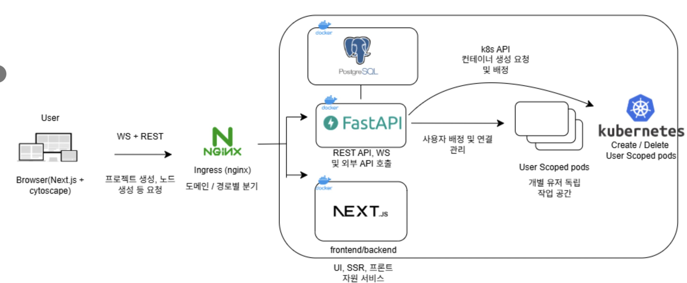
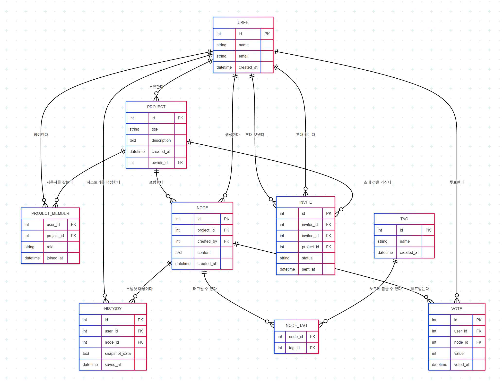

---

## A. 프로젝트 명
BRAINNET  |  AI 기반 싱글-유저 브레인스토밍·마인드맵 웹 애플리케이션

---

## B. 팀 구성 및 담당 파트

| 이름(학번) | 역할 | 주요 담당 |
|-----------|------|-----------|
| **김동건 (201624420)** | 팀 리더 · 프론트엔드 · AI | 웹 UI작성 • GPT 3.5 Turbo 배포 |
| **박재홍(201924475)** | 벡엔드 | 아키텍처 설계, FastAPI · PostgreSQL 개발 |
| **이승재(202029145)** | 벡엔드 · 프론트엔드 | API 설계 • 3티어 환경 구축, Next.js UI, Cytoscape.js 그래프 |

---

## C. 프로젝트 소개

**BRAINNET**은 GPT-3.5 Turbo 기반 **AI 마인드맵 엔진**으로 아이디어 발상을 ✨가속화✨하는 **싱글-유저 웹 애플리케이션**입니다.


| 핵심 기능        | 요약                                 |
| ------------ | ---------------------------------- |
| **AI 자동 확장** | 키워드 → GPT-3.5 Turbo가 1~2개의 관련 아이디어를 즉시 제안 |
| **그래프 시각화**  | Cytoscape.js로 노드·엣지를 드래그&드롭·확대/축소  |
| **태그 & 필터**  | 태그로 주제를 분류하고 조건별 하이라이트             |
| **히스토리 스냅샷** | 언제든 이전 상태로 되돌아갈 수 있는 변경 이력 저장      |

> ℹ️ 최종 버전에서는 **멀티테넌시**와 **동시 다중 사용자 편집** 기능을 제외했습니다.

---

## D. 프로젝트 필요성


원격 근무 시대에도 브레인스토밍은 **화면 공유 + 메모**나 **오프라인 포스트잇**에 의존하는 경우가 많습니다. 이 방식은

* **회의 후 별도 정리**가 필요해 생산성이 떨어지고
* **아이디어가 개인 경험에 편향**되는 한계가 있습니다.

**BRAINNET**은 다음 흐름을 **한 화면**에서 해결합니다.

```
아이디어 작성 → AI 연관 아이디어 확장 → 그래프 구조화 → 히스토리 저장
```

AI 추천으로 **창의적 사고의 폭**을 넓히고, 노드 색상·두께로 **중요도와 연관성**을 한눈에 파악하도록 도와줍니다.


---

## E. 선행 기술·논문·특허 조사
| 툴 이름     | 설명                                                                                         |
|------------|----------------------------------------------------------------------------------------------|
| LucidPark  | 무한 캔버스 기반의 온라인 협업 화이트보드. 아이디어를 트리 형태로 시각화. AI로 아이디어 트리 생성        |
| Miro       | 가상 화이트보드에서 아이디어 시각화, 노드 확장, 팀원 간 코멘트 및 채팅                              |
| Boardmix   | 온라인 협업 화이트보드, 브레인스토밍, 마인드맵, 플로우 차트와 AI 기반 아이디어 생성                    |

---

## F. 프로젝트 개발 결과물 소개 (+ 다이어그램)


프로젝트는 크게 프론트엔드와 백엔드로 구성되어 있으며, 각 서비스는 Docker 컨테이너 환경에서 구동됩니다.

프론트엔드: Next.js와 Cytoscape.js 기반으로 구현되어 아이디어를 노드 및 그래프 형태로 시각화합니다. 로그인, 회원가입, 대시보드, 프로젝트 관리 기능을 제공합니다.

백엔드: FastAPI와 PostgreSQL을 기반으로 RESTful API를를 지원하며, 사용자 관리, 아이디어 데이터 관리, 프로젝트 히스토리 관리를 수행합니다.


## 📑 API 요약

> Swagger UI: <http://localhost:8000/docs>  
> 모든 엔드포인트는 `application/json` 을 사용하며 JWT 헤더(`Authorization: Bearer <token>`)가 필요합니다.  
> **싱글-유저 버전**이라 WebSocket 브로드캐스트는 비활성화되어 있지만, REST 스펙은 유지됩니다.

### 🔐 Auth
| Method | Endpoint | 설명 |
| ------ | -------- | ---- |
| `POST` | `/auth/register` | 이메일·비밀번호 회원가입 |
| `POST` | `/auth/login` | 로그인 & JWT 발급 |

### 👤 Users
| Method | Endpoint | 설명 |
| ------ | -------- | ---- |
| `GET` | `/users/me` | 내 프로필 조회 |
| `GET` | `/users/me/tag-summaries` | 내가 사용한 태그별 노드 수 통계 |

### 📂 Projects
| Method | Endpoint | 설명 |
| ------ | -------- | ---- |
| `GET` | `/projects` | 프로젝트 목록 |
| `POST` | `/projects` | 새 프로젝트 생성 |
| `GET` | `/projects/{project_id}` | 프로젝트 상세 + 노드 트리 |
| `PUT` / `PATCH` | `/projects/{project_id}` | 이름·옵션 수정 |
| `DELETE` | `/projects/{project_id}` | 프로젝트 삭제 |
| `POST` | `/projects/{project_id}/invite` | (협업 버전) 초대 링크 발행 |
| `POST` | `/projects/join` | 초대 코드로 참여 |
| `GET` | `/projects/{project_id}/summary` | 노드·태그·투표 요약 통계 |

### 🌳 Nodes
| Method | Endpoint | 설명 |
| ------ | -------- | ---- |
| `GET` | `/projects/{project_id}/nodes` | 노드 리스트 |
| `POST` | `/projects/{project_id}/nodes` | 노드 대량 생성(AI 추천 결과 포함) |
| `PATCH` | `/projects/{project_id}/nodes/{node_id}` | 텍스트·위치·메타 수정 |
| `DELETE` | `/projects/{project_id}/nodes/{node_id}` | 노드 삭제 |
| `POST` | `/projects/{project_id}/nodes/{node_id}/activate` | 노드 활성화 |
| `POST` | `/projects/{project_id}/nodes/{node_id}/deactivate` | 노드 비활성화 |

### 🏷️ Tags
| Method | Endpoint | 설명 |
| ------ | -------- | ---- |
| `GET` | `/projects/{project_id}/tags` | 태그 목록 |
| `POST` | `/projects/{project_id}/tags` | 태그 생성 |
| `GET` | `/projects/{project_id}/tags/{tag_id}` | 태그 상세 |
| `PATCH` | `/projects/{project_id}/tags/{tag_id}` | 태그 수정 |
| `DELETE` | `/projects/{project_id}/tags/{tag_id}` | 태그 삭제 |
| `POST` | `/projects/{project_id}/tags/{tag_id}/nodes/{node_id}` | 노드에 태그 부착 |
| `DELETE` | `/projects/{project_id}/tags/{tag_id}/nodes/{node_id}` | 노드에서 태그 제거 |

### 👍 Votes
| Method | Endpoint | 설명 |
| ------ | -------- | ---- |
| `POST` | `/projects/{project_id}/tags/{tag_id}/vote` | 태그 단위 투표 |
| `POST` | `/projects/{project_id}/votes/confirm` | 투표 결과 확정 |

### 🕑 History
| Method | Endpoint | 설명 |
| ------ | -------- | ---- |
| `GET` | `/projects/{project_id}/history` | 스냅샷 타임라인 |
| `GET` | `/projects/{project_id}/history/{entry_id}` | 특정 스냅샷 내용 |

> **스키마** – Swagger UI 상단의 `Schemas` 탭에서  
> `ProjectOut`, `NodeOut`, `TagOut`, `VoteOut` 등 응답 구조를 확인할 수 있습니다.

## ERD 다이어 그램



### 디렉터리 구조

```
BRAINNET
├─ backend
│  ├─ alembic/           # DB 마이그레이션
│  ├─ app/
│  │  ├─ core/           # 설정·보안·의존성
│  │  ├─ db/             # 세션·CRUD 헬퍼
│  │  ├─ models/         # SQLAlchemy + Pydantic
│  │  ├─ routers/        # REST & WebSocket
│  │  └─ utils/
│  └─ envexample
└─ frontend
│   ├─ public/           # 정적 리소스
│   └─ src/
│       ├─ app/          # Next.js 라우트(dashboard, login, register)
│       ├─ features/     # Zustand 상태·API 모듈
│       ├─ lib/          # axios 래퍼, 헬퍼
│       └─ types/        # 공용 TS 타입
└─ images       # README 이미지 플더

```

---

## G. 사용 방법

### 요구 사항
- **Docker** ≥ 24  
- **Docker Compose** ≥ v2  

### 설치 & 실행
```bash
git clone https://github.com/PHJ2000/BrainNet.git
cd BrainNet

# 환경 변수 설정
cp backend/envexample .env
cp frontend/.env.example frontend/.env.local   # OPENAI_API_KEY 등 기입

# 빌드 & 기동
docker compose up --build -d
```

| 서비스 | 주소 |
| ------- | ----------------------------- |
| **Frontend** | <http://localhost:3000> |
| **Backend docs** | <http://localhost:8000/docs> |

### 컨테이너 제어
```bash
docker compose stop                       # 중지
docker compose start                      # 재시작
docker compose down -v --remove-orphans   # 완전 제거
```

---

## H. 활용 방안

| 사용 시나리오 | 기대 효과 |
| ------------- | ---------- |
| **개인 기획·논문 주제 구상** | 키워드 → AI 확장 → 빠른 구조화 |
| **강의·워크숍 과제** | 학생 개인 브레인맵 작성 → 스냅샷으로 과정 평가 |
| **팀 회의 전 사전 브레인스토밍** | 정제된 아이디어 공유 → 회의 시간 단축 |

> 향후 SaaS 버전에서 **실시간 협업 · 템플릿 · 자동 클러스터링**을 추가해  
> 원격 팀 아이디어 회의 플랫폼으로 확장할 예정입니다.

---

### 라이선스
MIT License

### 문의
[koreaworldclass@gmail.com](mailto:koreaworldclass@gmail.com) · GitHub Issues
